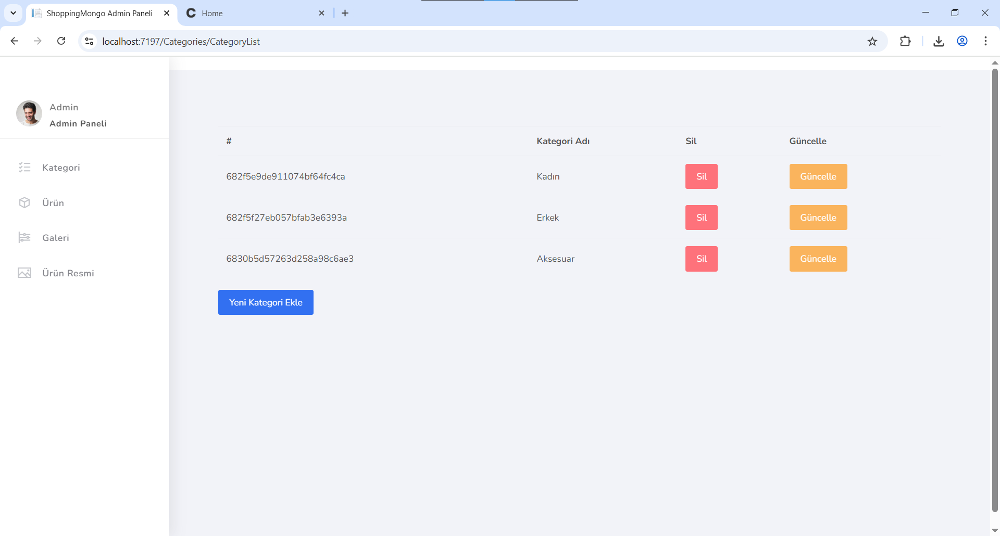
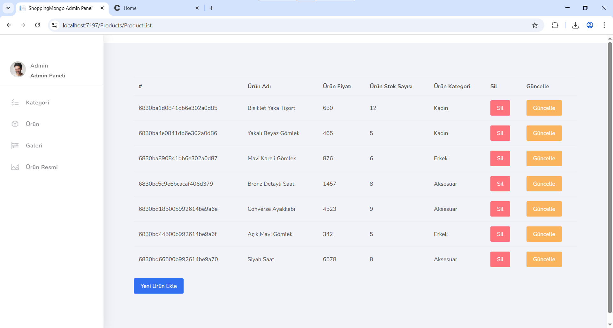
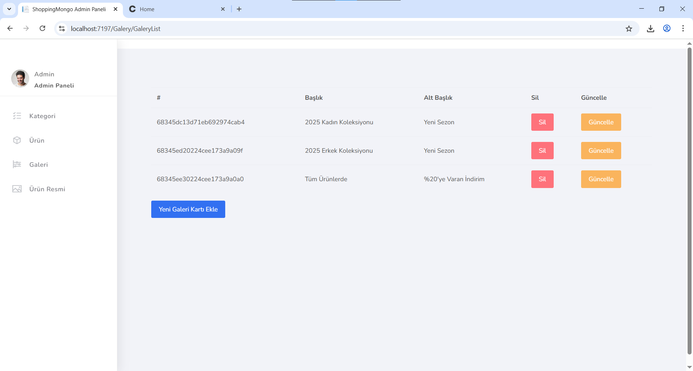
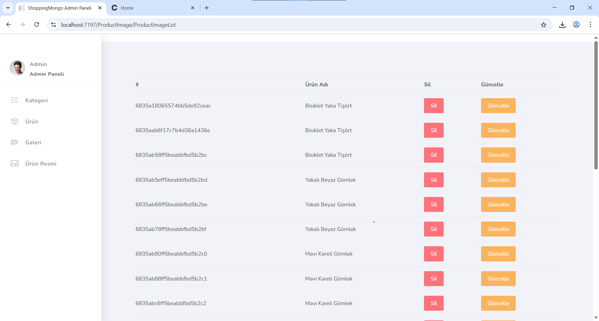

# ShopingNightMongo

ShopingNightMongo, MongoDB veritabanı kullanan modern bir e-ticaret web uygulamasıdır. ASP.NET Core MVC mimarisi kullanılarak geliştirilmiştir.

## 🚀 Özellikler

- Ürün yönetimi
- Kategori yönetimi
- Müşteri yönetimi
- Galeri yönetimi
- Ürün görseli yönetimi
- Responsive tasarım
- MongoDB veritabanı entegrasyonu

## 🛠️ Teknolojiler

- ASP.NET Core MVC
- MongoDB
- AutoMapper
- Bootstrap
- HTML5/CSS3
- JavaScript

## 📋 Gereksinimler

- .NET 6.0 veya üzeri
- MongoDB Server
- Visual Studio 2022 veya Visual Studio Code

## 📁 Proje Yapısı

```
ShopingNightMongo/
├── Controllers/        # MVC Controller'lar
├── Models/            # View Model'ler
├── Views/             # Razor View'lar
├── Services/          # İş mantığı servisleri
├── Entities/          # Veritabanı entity'leri
├── Dtos/              # Data Transfer Objects
├── Mapping/           # AutoMapper profilleri
├── Settings/          # Uygulama ayarları
└── wwwroot/           # Statik dosyalar
```

## 🔐 Güvenlik

- HTTPS yönlendirmesi aktif
- HSTS (HTTP Strict Transport Security) aktif
- Güvenli bağlantı yapılandırması

## 📸 Ekran Görüntüleri

### Ana Sayfa


### Kategori Yönetimi


### Ürün Yönetimi


### Galeri Yönetimi


### Ürün Resim Yönetimi
 
